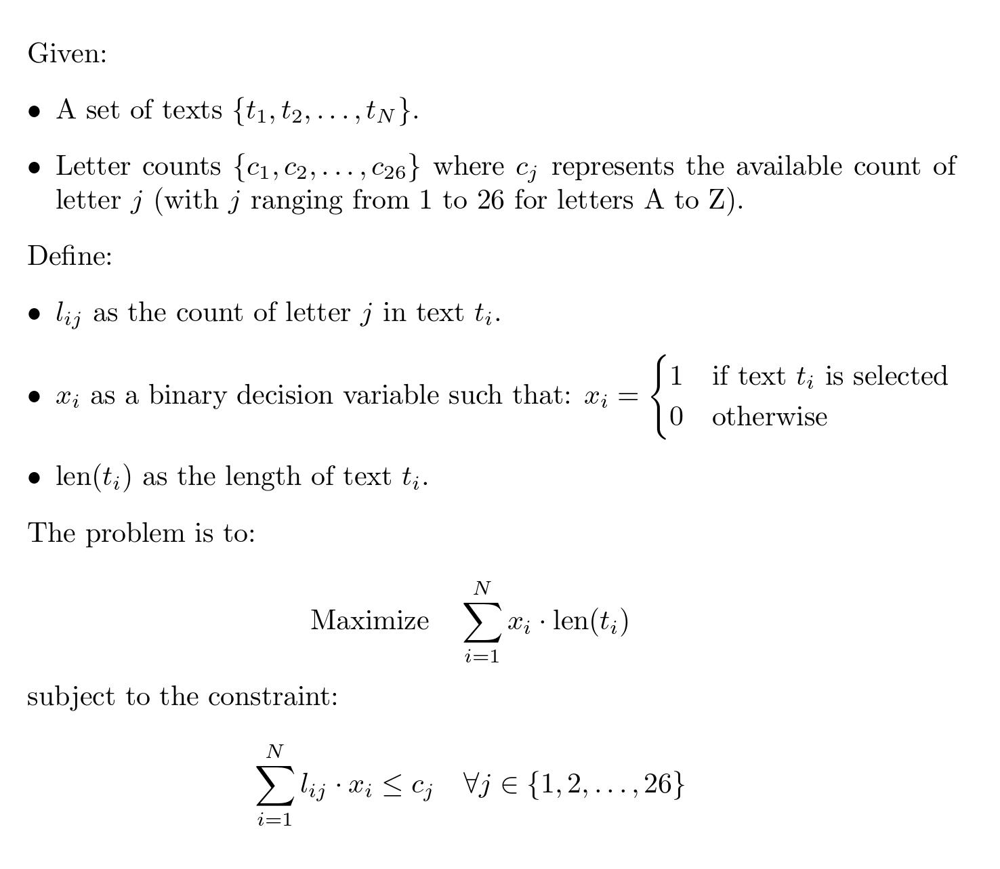

# Friendship Bracelet Optimizer

## Introduction

This is a program that takes letters and a list of strings and finds the best strings to form using the given letters so that as many letters as possible are used. In other words, it minimizes the leftover letters. The idea of this program was to help in building [friendship bracelets](https://www.theguardian.com/music/2024/feb/07/taylor-swift-eras-tour-australia-friendship-bracelets-inspiration-beads-explained) for Taylor Swift's Eras tour. My girlfriend is a huge swiftie and wanted to use her available letters as efficiently as possible. This repository contains both a (slow) recursive dynamic programming solution and a (fast) integer linear programming solution for the problem.

## The problem

Finding the best bracelet texts is a variation of classic [Knapsack problem](https://en.wikipedia.org/wiki/Knapsack_problem), which is known to be NP-hard. Specifically, the problem is [0/1 multidimensional knapsack problem](https://www.scirp.org/journal/paperinformation?paperid=87646)

It can be formulated as follows:

## The dynamic programming solution

The initial solution used [dynamic programming](https://en.wikipedia.org/wiki/Dynamic_programming) with memoization. However, the running time of this approach exploded as the amount of available letters grew. I suspect the reason for this to be the limited overlap between subproblems – only a few combinations of texts lead to precisely the same letter usage. Adding the memoization to the recursive function actually increased the running time (likely due to the the overhead of storing the letter states). On my machine the running time of the dynamic programming solution with a data set of 61 available letters and 305 bracelet text options is about 1 minute and 15 seconds without and 2 minutes with memoization. With the real letter counts (total of 283 letters) the program did not finish execution in 5 hours.

## The integer linear programming solution

This more efficient method leverages [integer linear programming](https://en.wikipedia.org/wiki/Integer_programming) with the help of the python library [PuLP](https://pypi.org/project/PuLP/) that calls [CBC solver](https://github.com/coin-or/Cbc). The running time with real letter counts was just a few seconds.

## Files

- `bracelet_texts.py`: Contains a python list of all different bracelet_texts. If you use the program, feel free to modify it to your liking.
- `find_bracelet_texts_ilp.py`: Implements a function that finds the best texts using integer linear programming.
- `find_bracelet_texts_recursive.py`: Implements the dynamic programming solution.
- `main.py`: Contains the main program that loads the Excel file with letter counts, preprocesses the texts, calls the chosen solver function and prints the results.
- `plot.py`: Contains a script that plots the counts of the available letters and compares them to the letter counts of the texts.
- `test_find_bracelet_texts.py`: Contains a few manually engineered test cases for the solver functions.
- `data`/
  - `letter_counts_real.xlsx`: The letter counts for which I wanted to find the best texts (total of 283 letters)
  - `letter_counts_test_small.xlsx`: A small test letter set (total of 25 letters)
  - `letter_counts_test_small2.xlsx`: Another small test letter set (total of 29 letters)
  - `letter_counts_test_medium.xlsx`: A slightly larger test letter set (total of 61 letters)
